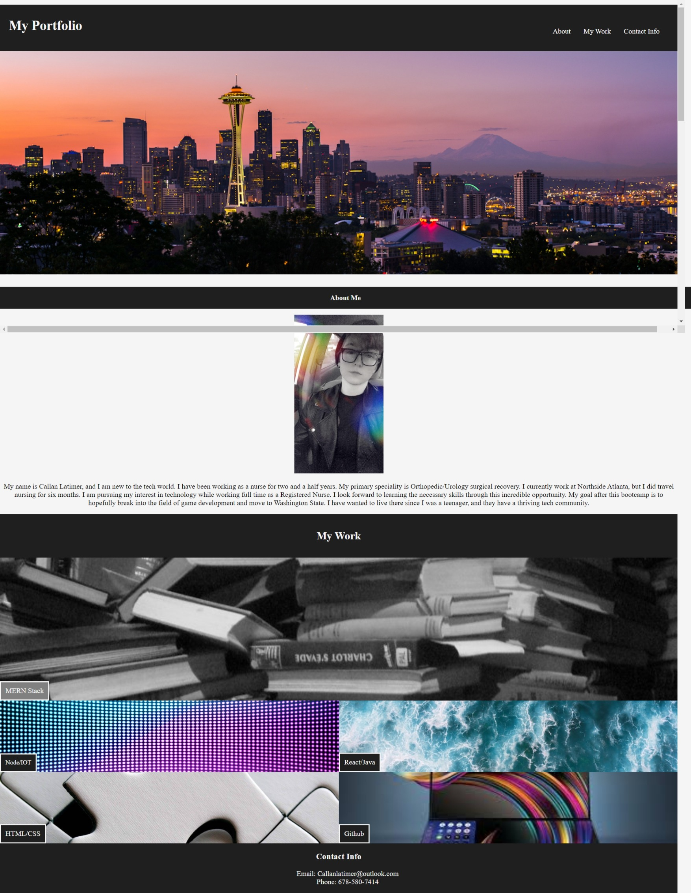

# Challenge2_Portfolio

# Description of Project
The purpose of this project is to create a reactive page which adjusts to fit all its internal elements on multiple screens. 
In addition, it provides potential employers with a way to sample my work and find out more infomation about me. 

## List of Reactive Elements
[CSS]
* Created variables for recurring elements in stylesheet to prevent redundancy
* `<nav>` elements are linked to related content; they also turn red when hovered over
* `<main>` element contained within a flex box to allow responsive content
* `<section>` elements within `<main>` tag have flex styling as well to allow them to grow/shrink as needed
* Used class ID "work" to apply styling to both headings for "About Me" and "My Work" sections
* Created a separate class for the first `<section>` element within the flexbox to allow it to be bigger than the other elements
* Nested `<a>` links within `
` elements in the `<main>` flex box to allow users to go to linked content
* Created a hover element for the `
` element for accessibility
* Unable to add alt tags for images other than selfie because images in flexbox are acting as a background element
* Created flex box for `<footer>` element to allow it to flex with the page and also stay at the bottom of the page 

## Assets

[LinktoRepository](https://github.com/Clatimer97/Challenge2_Portfolio)

## References
* For my reset stylesheet, I used the Eric Meyer reset stylesheet which is a standardized reset stylsheet available on the internet. The link to reference it is posted below.
[LinktoStylesheet](https://meyerweb.com/eric/tools/css/reset/)

## Author
[@CallanLatimer](https://github.com/Clatimer97)
